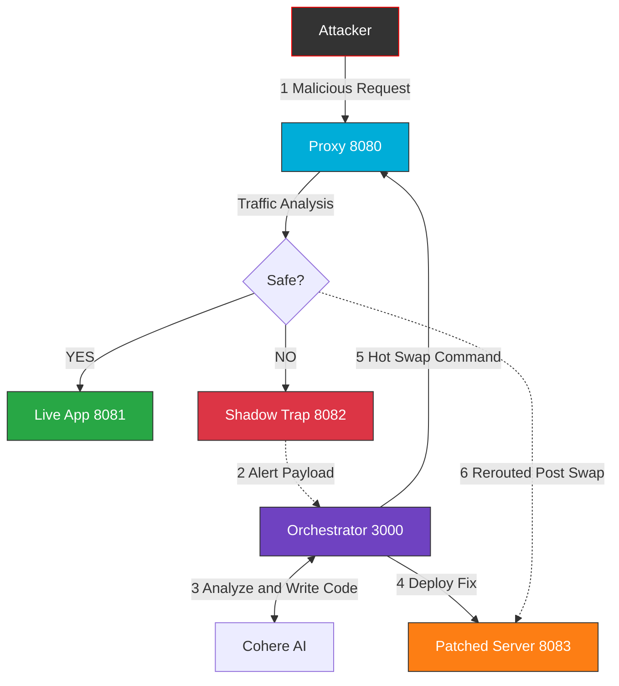

<div align="center">
  <h1> AEGIS DEFENSE GRID</h1>
  
  <p style="font-size: 1.5rem; font-style: italic; margin-top: 0;">
    "Static Defense is Death. Adapt or Expire."
  </p>
  
  <p>
    <strong>A Self-Healing, Distributed Cybersecurity Architecture empowered by Generative AI.</strong>
  </p>

  <p>
    <a href="https://go.dev/">
      
    </a>
    <a href="https://cohere.com/">
      
    </a>
    <a href="#">
      
    </a>
    <a href="#">
      
    </a>
    
  </p>
  <p style="font-size: 1.1rem; margin-top: 20px; color: #ff69b4;">
✨ <strong>Special Thanks to Shreya Baranwal</strong> ✨
</p>
</div>
</div>


---

##  Transmission 001: The Concept

> "In modern cyber-warfare, firewalls are just speed bumps. The AEGIS Protocol does not just block attacks—it consumes them, analyzes them, and evolves instantly."

**AEGIS** creates a new category of infrastructure: *The Self-Healing Network*.

Traditional WAFs (Web Application Firewalls) are binary: Block or Allow. Aegis is dynamic. It functions as a **Distributed Trap**. When an attacker strikes, we don't just reject the packet. We silently reroute them to a **Shadow Realm** (Honeypot), extract their payload, feed it to a Neural Engine (Cohere AI), and autonomously write a patch to fix the vulnerability in real-time.

---

##  Core Architecture & Innovations

### 1. The Gatekeeper (Reverse Proxy)
The entry point of the grid running on **Port 8080**.
* **Traffic Analysis:** Uses regex heuristics to inspect every byte of incoming traffic.
* **Dynamic Routing:** Legitimate users are routed to the **Live App**. Malicious actors are silently diverted to the **Shadow Trap**.
* **Active Defense:** Capable of receiving "Ban Orders" from the Orchestrator to blacklist IPs instantly.

### 2. The Shadow Trap (Honeypot)
A high-fidelity replica of the production server running on **Port 8082**.
* **Deception:** It looks, feels, and acts like the real server.
* **Data Leak Simulation:** When attacked (e.g., SQL Injection), it simulates a successful breach, rendering fake data to keep the attacker engaged.
* **The Snitch:** While the hacker celebrates, the Shadow Server executes a silent `POST` callback to the Brain, transmitting the attack vector.

### 3. The Neural Orchestrator (The Brain)
The central intelligence running on **Port 3000**.
* **AI Forensics:** Connects to **Cohere AI (Command R+)** to analyze the raw attack payload.
* **Generative Patching:** The AI writes a new, secure Go server file (`secure.go`) that fixes the specific vulnerability used by the attacker.
* **Hot Deployment:** The Brain spins up the new server on a fresh port (**8083**) and commands the Proxy to hot-swap traffic.

---

##  The Self-Healing Loop: The Flow

1.  **Infiltration:** Attacker sends a malicious payload (e.g., `admin'OR'1'='1`).
2.  **Detection:** Proxy recognizes the pattern but allows the request to pass to the Trap.
3.  **Extraction:** The Shadow Server captures the payload and alerts the Brain.
4.  **Analysis:** Cohere AI breaks down the SQL Injection and generates a sanitized Go handler.
5.  **Remediation:**
    * Brain writes `patched_server/secure.go`.
    * Brain starts the new server.
    * Brain tells Proxy: *"Switch traffic to Port 8083."*
6.  **Immunity:** The attacker tries the same exploit again. It fails. The system has evolved.

---

##  System Topology

We engineered a pure-Golang distributed system to minimize latency and dependency overhead.



##  Installation & Operation
### Prerequisites:

1. **Go** (Golang 1.20+)
2. Cohere API Key (Free Trial)

1. Clone & Configure
```Bash
git clone https://github.com/your-repo/aegis-defense-grid.git
cd aegis-defense-grid
```
Open orchestrator_server/brain.go and paste your API Key:

2. Ignite the Grid (Distributed Terminal Setup)
You need 4 Terminals to simulate the microservices architecture.

### Terminal 1: The Safe App

```bash
cd positive_server
go run positive.go
```
### Terminal 2: The Shadow Trap

```md
cd shadow_server
go run negative.go
```
### Terminal 3: The Brain

```md
cd orchestrator_server
go run brain.go
```
### Terminal 4: The Proxy (Gatekeeper)

```md
# In root folder
go run main.go analyzer.go
```

2. Open your browser and navigate to the test link: http://localhost:8080/sqlinjection?q=admin'OR'1'='1

3. Observe: You are redirected to the Red (Shadow) page. It shows a "Database Leaked" message. The hacker thinks they won.

4. Logs: Watch the Brain Terminal. You will see:

5. SECURITY INCIDENT RECEIVED  Analyzing & Generating Patch...

## Phase 2: The Evolution

1. Wait 2-3 seconds for the AI to code the fix.

2. Logs: The Brain will report:

3. Patched Server Started on Port 8083! Updating Proxy Routing Rules...

4. Logs: The Proxy will report:

5. [HOT SWAP] Traffic shifted!

## Phase 3: The Immunity

1. Refresh the browser (or click the link again).

2. Observe: You are NO LONGER on the Red page. You are served a Safe/Sanitized response from the new AI-generated server.

3. The system healed itself without human intervention.

## Roadmap: Phase 2
1. Docker Orchestration: Move from local processes to dynamic Container spawning. 
2. Database Integration: Connect to a real Postgres instance to demonstrate actual connection pooling patches. 
3. Vector Defense: Expand AI analysis to cover XSS and RCE attacks. [ ] Admin Dashboard: A React frontend to visualize the live traffic and server status.

##  The Architect

**Architecture:** Golang Distributed System

**AI Integration:** Cohere Command Model

**Defense Strategy:** Active Deception
